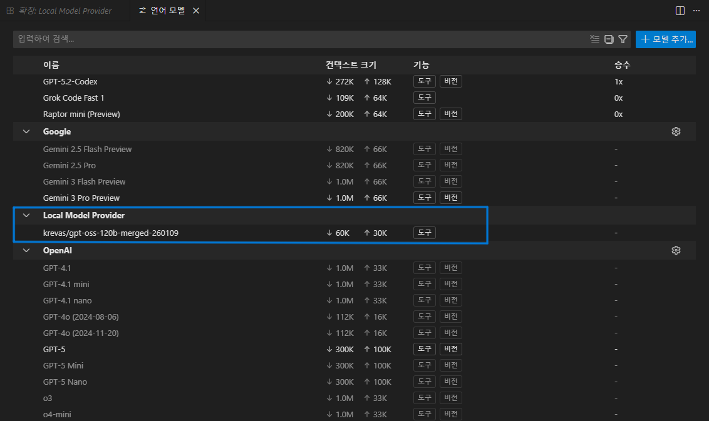
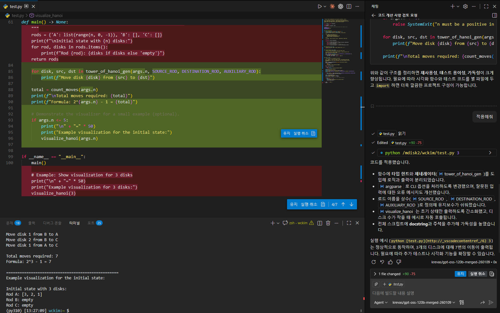
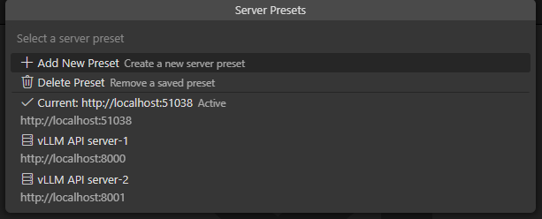

# Local Model Provider


**Connect your local LLMs directly to VS Code for a private and powerful AI coding experience.**

A VS Code extension that connects your editor to self‑hosted or local LLMs via any OpenAI‑compatible server (vLLM, Ollama, TGI, llama.cpp, LocalAI, etc.). Keep source code on your infrastructure while using AI for coding, refactoring, analysis, and more.


## ✨ Highlights

- Works with any OpenAI Chat Completions–compatible endpoint
- Function calling tools with optional parallel execution
- Safe token budgeting based on model context window
- Built‑in retries with exponential backoff and detailed logging
- Model list caching for fewer network calls
- API keys securely stored in VS Code SecretStorage
- Status bar health monitor with quick actions
- Server presets for quick switching between endpoints
- Usage statistics tracking (requests, tokens, response times)
- Default model selection for consistent workflow

## 🔌 Compatible Inference Servers

- vLLM (recommended)
- Ollama
- llama.cpp
- Text Generation Inference (Hugging Face)
- LocalAI
- Any other OpenAI‑compatible server

## 📥 Installation

1) Install “Local Model Provider” from the VS Code Marketplace.
2) Reload VS Code if prompted.

## 🚀 Quick Start

1) Start a server
- vLLM example (gpt-oss-120b)
  ```bash
  vllm serve openai/gpt-oss-120b \
  --trust-remote-code \
  --enable-auto-tool-choice \
  --tool-call-parser openai \
  --reasoning-parser openai_gptoss \
  --tensor-parallel-size 2 \
  --host 0.0.0.0 \
  --port 8000 \
  --max-model-len 131072 \
  --gpu-memory-utilization 0.8 \
  --disable-log-requests \
  --enable-prefix-caching \
  --async-scheduling
  ```
  Options explained (brief):
  - `--trust-remote-code`: allow custom model repo code to run (required by some model repos)
  - `--enable-auto-tool-choice`: let the model/server automatically pick and call tools
  - `--tool-call-parser openai`: use OpenAI function calling format
  - `--reasoning-parser openai_gptoss`: reasoning parser compatible with GPT‑OSS
  - `--tensor-parallel-size 2`: split the model across 2 GPUs (tensor parallelism)
  - `--host 0.0.0.0`: listen on all network interfaces
  - `--port 8000`: server port
  - `--max-model-len 131072`: max context length (tokens)
  - `--gpu-memory-utilization 0.8`: VRAM usage ratio per GPU
  - `--disable-log-requests`: reduce request logging noise
  - `--enable-prefix-caching`: enable prefix/KV cache for repeated prompts
  - `--async-scheduling`: schedule requests asynchronously for better throughput
  
- Ollama example
  ```bash
  ollama run qwen3:8b
  ```

2) Configure the extension
- Open VS Code Settings and search for “Local Model Provider”.
- Required: set `local.model.provider.serverUrl` (e.g. http://localhost:8000)
- Optional: run “Local Model Provider: Set API Key (Secure)” to store a key in SecretStorage

3) Use your models
- Open the model manager and enable models from the “Local Model Provider”.

## 🖼️ Screenshots

- Model configuration


- Model selection



- Test execution



- Feature menu


- Server preset



## ⚙️ Configuration

All settings are under the `local.model.provider.*` namespace.

### Server Configuration
- `serverUrl` (string): base URL, e.g. `http://localhost:8000`
- `serverPresets` (array): saved server configurations for quick switching
- `defaultModel` (string): default model ID to use (leave empty for auto-select)
- `requestTimeout` (number, ms): default 60000

### Token & Context Settings
- `defaultMaxTokens` (number): estimated context window (default 32768). If your model/server supports larger context, consider increasing this for better continuity (e.g., 65k–128k).
- `defaultMaxOutputTokens` (number): max generation tokens (default 4096). Increase when you need longer answers; ensure input + output stays within the model's context window.

### Function Calling
- `enableToolCalling` (boolean): enable function calling (default true)
- `parallelToolCalling` (boolean): allow parallel tool calls (default true)
- `agentTemperature` (number): temperature with tools (default 0.0)

### Sampling Parameters
- `topP` (number): nucleus sampling (default 1.0)
- `frequencyPenalty` (number): repetition penalty (default 0.0)
- `presencePenalty` (number): topic shift encouragement (default 0.0)

### Reliability & Performance
- `maxRetries` (number): retry attempts (default 3)
- `retryDelayMs` (number): backoff base delay (default 1000)
- `modelCacheTtlMs` (number): model list cache TTL (default 300000)
- `logLevel` ("debug" | "info" | "warn" | "error")

API keys are not stored in settings. Use the command palette:
- “Local Model Provider: Set API Key (Secure)”

## ⌨️ Commands

- "Local Model Provider: Set API Key (Secure)" — Store/remove API key in SecretStorage
- "Local Model Provider: Show Server Status" — Open the status bar menu with quick actions
- "Local Model Provider: View Models & Set Default" — Browse available models and set a default
- "Local Model Provider: Switch Server Preset" — Quick switch between configured server endpoints
- "Local Model Provider: View Usage Statistics" — Display session statistics (requests, tokens, response times)
- "Local Model Provider: Refresh Model Cache" — Clear cache and fetch models from server

## 🏥 Status Bar Health Monitor

See connection status at a glance. Click to open quick actions:
- View and set default model
- Switch server presets
- View usage statistics
- Refresh model cache
- Set API key
- Open settings
- Show logs

The status bar displays:
- Connection status (connected/error/unknown)
- Number of available models
- Session statistics when available

## 🔧 Troubleshooting

Models don’t appear
1) `curl http://HOST:PORT/v1/models` and confirm the server responds
2) Verify `serverUrl` is correct (protocol/port included)
3) Run “Local Model Provider: Test Server Connection”

Empty response
1) Ensure the correct tool‑call parser for your model family (e.g. vLLM `--tool-call-parser`)
2) Disable `enableToolCalling` to test plain chat
3) Large conversations are truncated automatically; try with fewer messages

Tool call formatting issues
1) Disable `parallelToolCalling` for unstable models
2) Set `agentTemperature` to 0.0 for more consistent formatting

Out‑of‑memory (OOM)
- Reduce `--max-model-len`, use a quantized model (AWQ/GPTQ/FP8), or pick a smaller model

## 🔒 Security & Privacy

- Requests are sent only to the server you configure.
- If authentication is required, API keys are stored securely via VS Code SecretStorage.
- Sensitive data (like API keys) is never written to logs.

## 📜 License

Licensed under the [MIT](LICENSE) license.

## 💬 Support

- Issues & Feature Requests: https://github.com/krevas/local-model-provider/issues
